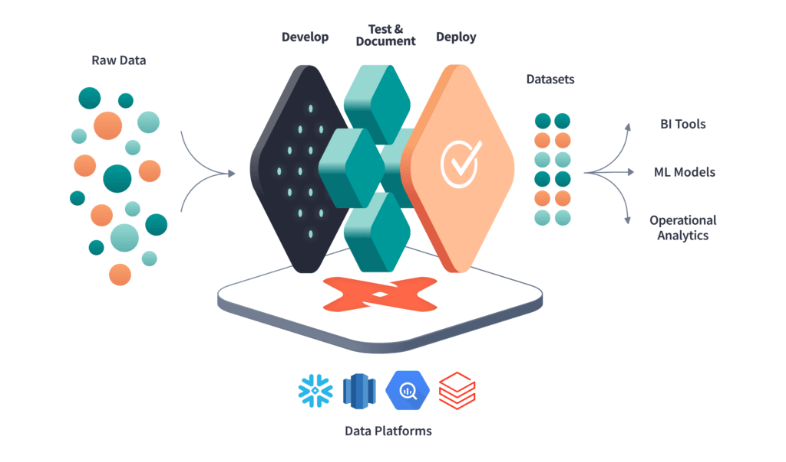

## Introdução Ferramenta DBT (Data Build Tool)

 Documentação: https://docs.getdbt.com/


---

## O que é dbt?
DBT, que significa **_"data build tool"_**, é uma ferramenta open-source projetada para ajudar equipes de análise de dados a transformar, organizar e gerenciar seus dados de forma mais eficiente. Ele opera na camada de transformação de dados em um ambiente de data warehouse, permitindo que os analistas escrevam, testem e executem transformações SQL de maneira escalável e controlada.

## Objetivo do dbt
O objetivo principal do dbt é facilitar o desenvolvimento, a documentação e a manutenção de pipelines de dados. Ele promove práticas de desenvolvimento ágil e colaborativo, permitindo que os analistas de dados trabalhem de forma mais eficiente e eficaz na criação e manutenção de conjuntos de dados analíticos confiáveis.

## Vantagens do dbt

- **Simplicidade**: O dbt utiliza SQL como sua linguagem principal, o que o torna acessível para analistas e engenheiros de dados que já estão familiarizados com SQL.

- **Reprodutibilidade**: As transformações no dbt são definidas como modelos SQL, o que permite a reprodução consistente dos resultados.

- **Testabilidade**: O dbt oferece recursos integrados para escrever testes automatizados em seus modelos, garantindo a qualidade e integridade dos dados.

- **Documentação automática**: O dbt gera automaticamente documentação para os modelos, o que facilita o entendimento do fluxo de dados e a colaboração entre os membros da equipe.

- **Integração com controle de versão**: Como o dbt trata as transformações como código, ele pode ser facilmente integrado a sistemas de controle de versão como Git, facilitando o gerenciamento de mudanças e colaboração em equipe.

---
### Neste exemplo utilizaremos o conector:
* sqlserver

## Pré-requisitos
- Python
- VSCode
- Git (opcional)

## Configurações Iniciais

### Criação do arquivo .gitignore
Crie um arquivo `.gitignore`


### Criação do Repositório no GitHub
1. Inicialize o repositório:
    ```sh
    git init
    git branch -M main
    git checkout -b main
    git add .
    git commit -m "Create a dbt project"
    ```
2. Adicione o repositório remoto e envie as alterações:
    ```sh
    git remote add origin https://github.com/USERNAME/dbt-tutorial.git
    git push -u origin main
    ```

### Criação do Ambiente Virtual
1. Crie o ambiente virtual:
    ```sh
    python -m venv .venv
    ```
2. Ative o ambiente virtual:
    ```sh
    .\.venv\Scripts\Activate
    ```

### Instalação do Poetry
1. Instale o Poetry no ambiente virtual:
    ```sh
    pip install poetry
    ```
2. Verifique a instalação do Poetry:
    ```sh
    poetry --version
    ```

### Inicialização do Projeto com Poetry
1. Inicialize um novo projeto (caso ainda não tenha feito isso):
    ```sh
    poetry new projeto
    ```
2. Navegue até o diretório do projeto:
    ```sh
    cd projeto
    ```

### Adicionar Dependências ao Projeto
1. Adicione as dependências ao seu projeto:
    ```sh
    poetry add dbt-core@1.7.3 dbt-sqlserver@1.7.4
    ```
    **Nota:** As versões especificadas para `dbt-core` e `dbt-sqlserver` têm dependências conflitantes. Certifique-se de instalar uma versão do `dbt-core` que seja compatível com `dbt-sqlserver`.

2. Verifique a versão:
    ```sh
    dbt --version
    ```

### Inicialização do DBT
1. Acesse o diretório padrão do projeto:
    ```sh
    cd .\projeto\
    ```
2. Inicialize o DBT:
    ```sh
    dbt init minerva
    ```
3. Escolha o database:
    ```
    [2] sqlserver
    ```
4. Acesse a pasta inicializada:
    ```sh
    cd .\minerva\
    ```

### Cria arquivo source.yml para conectar aos dados
#### Crie o arquivo dentro da pasta models
```yml
version: 2

sources:
  - name: sqlserver
    database: dw_hml
    schema: dw_datamart_rh
    tables:
      - name: tab_rh_br_funcionario_SAP_backup_19092023
```

### Configuração do profiles.yml
Caso o DBT não crie o arquivo `profiles.yml`, crie-o manualmente na pasta de usuário do seu computador:
Exemplo: `C:\Users\edvaldo.ferreira\.dbt\profiles.yml`


#### Exemplo de profiles.yml
```yaml
minerva:
  outputs:
    dev:
      type: sqlserver
      driver: 'ODBC Driver 17 for SQL Server'
      server: 'WMINCPTSQLDW01\DWMINERVA'
      database: 'dw_hml'
      schema: 'eferreira'
      user: 'seu_usuario'
      password: 'sua_senha'
      port: 1433
      threads: 4
      authentication: 'sql'
      encrypt: true
      TrustServerCertificate: yes

    prod:
      type: sqlserver
      driver: 'ODBC Driver 17 for SQL Server'
      server: 'WMINCPTSQLDW01\DWMINERVA'
      database: 'dw_hml'
      schema: 'dbo'
      user: 'seu_usuario'
      password: 'sua_senha'
      port: 1433
      threads: 4
      authentication: 'sql'
      encrypt: true
      TrustServerCertificate: yes

  target: dev
```


## Comandos

- Verificar Configuração e conexão
```bash
    dbt debug
```

- Exemplo de criação da tabela dim_calendario
```bash
dbt run --select dim_calendario
```

- Exemplo de criação de tabela de dimensão SCD tipo 2.
```bash
dbt snapshot
dbt run --select <dim_scd2>
```

- Criar documentação do modelo de dados
```bash
dbt docs generate
dbt docs serve
```

- Instala packages
```bash
dbt deps
```

- Compilar e executar os modelos definidos
```bash
dbt build
dbt run
```

### Criação e Execução de Modelos

#### Contexto:

No contexto do dbt (data build tool), tanto dbt run quanto dbt build são comandos que executam etapas importantes no processo de desenvolvimento de pipelines de dados, mas têm propósitos ligeiramente diferentes:

- dbt run:

    O comando dbt run é usado para compilar e executar os modelos definidos em um projeto dbt. Ele executa as consultas SQL definidas nos modelos e cria ou atualiza as tabelas resultantes no seu data warehouse.
    Este comando é frequentemente usado durante o desenvolvimento e teste, quando você deseja garantir que suas transformações de dados estejam atualizadas e funcionando conforme o esperado.
    dbt build:

- dbt build:

    O comando dbt build, por outro lado, é usado para compilar todos os modelos definidos em um projeto dbt, mas sem executá-los no seu data warehouse.
    Este comando é útil quando você quer apenas garantir que a estrutura e sintaxe SQL dos seus modelos estejam corretas, mas não deseja executá-los ou atualizar as tabelas no data warehouse.


### Crie um modelo 
```bash
dbt run --select <modelo>
```